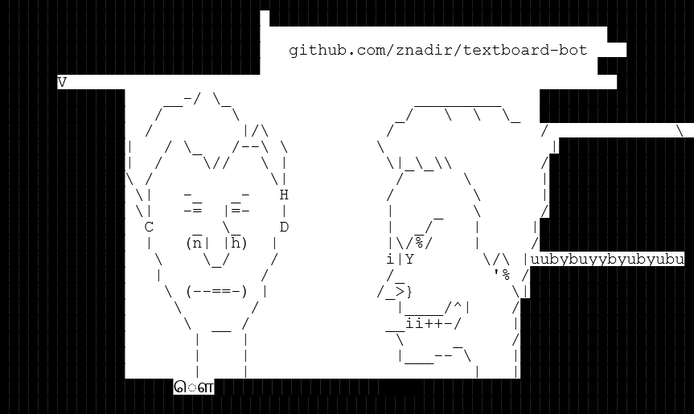

# TextBoard Bot

Ce bot a été conçu dans le cadre de l'expérience d'Aywen sur [TextBoard.fr](https://textboard.fr).

Grâce à sa connexion directe au protocole WebSocket, ce script offre des performances optimales et une réactivité inégalée pour interagir avec la plateforme.

## Fonctionnalités

- ✅ Gestion des threads
- ✅ Prise en charge de tous les types de caractères
- ✅ Fonctionnement continu avec reprise automatique après un crash

## Problèmes courants

### 1. J'ai un écran blanc, que faire ?

Si vous voyez un écran blanc, cela signifie probablement que vous utilisez le même compte Google pour le bot et pour visualiser votre dessin. Cependant, une seule connexion WebSocket (WS) est autorisée par compte. Pour résoudre ce problème, utilisez un compte Google alternatif pour le bot.

### 2. Je ne vois pas mon dessin

Si vous ne voyez pas votre dessin ou si plusieurs erreurs apparaissent :

- Vérifiez que vous avez correctement entré votre **token JWT**.
- Assurez-vous que les coordonnées sont correctement configurées.



## Installation

Clonez le dépot

```bash
git clone <url>
```

Installez dépendances.

```bash
pip install -r requirements.txt
```

## Utilisation

1. **Configuration** :
   Ouvrez le fichier `main.py` et configurez les variables nécessaires, notamment votre **token JWT**,que vous pouvez récupérer depuis vos cookies de navigateur.

2. **Exécution** :
   Lancez le bot avec la commande suivante :

```bash
python main.py
```

## Contribution

Les contributions sont les bienvenues! N'hésitez pas à ouvrir une issue ou à soumettre une pull request.
